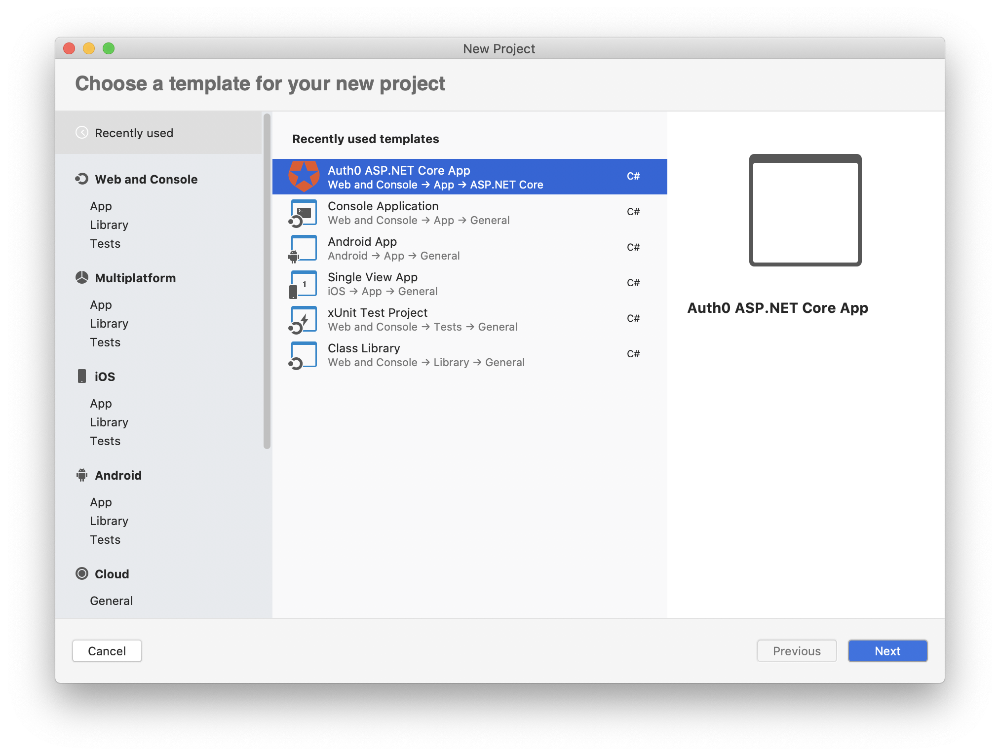
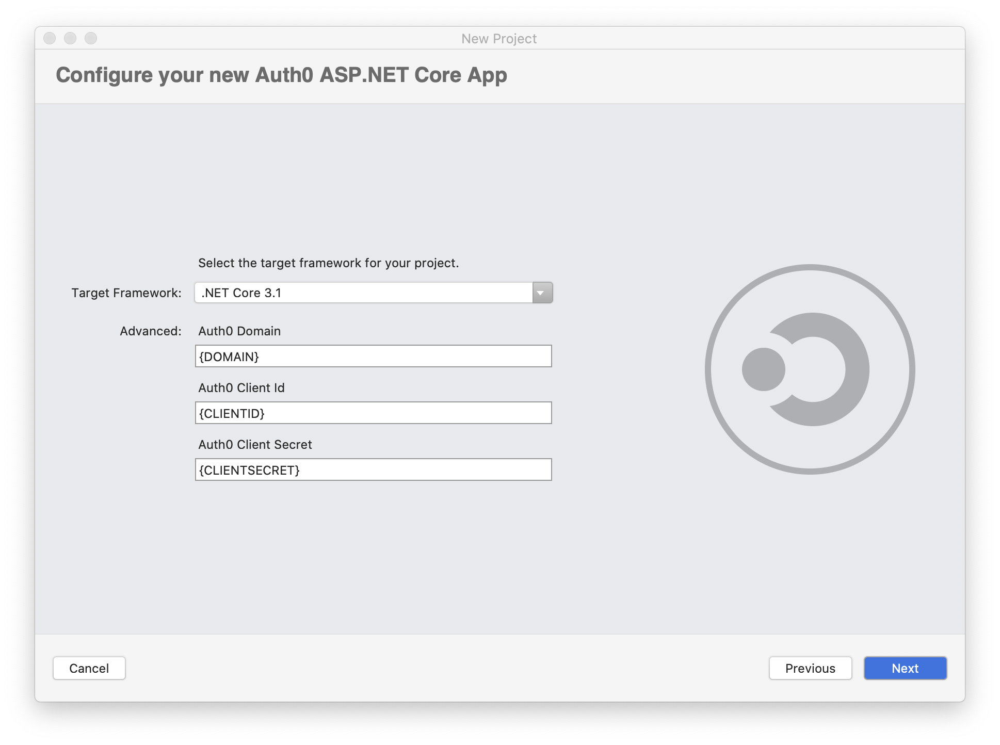

This repository contains a .NET project template for creating an ASP.NET web application with [Auth0](https://auth0.com/) authentication.

It demonstrates how to create .NET project templates for .NET CLI and Visual Studio. Please, check out this article for more details: [How to Create Your .NET Project Template](https://auth0.com/blog/create-dotnet-project-template/)

---
### Technology

This project uses the following technologies:

- [.NET Core SDK 3.1](https://dotnet.microsoft.com/download/dotnet-core/3.1)
- [Auth0](https://auth0.com/)

### Installing the Template

To install the template implemented in this project, you need to follow these steps:

1. Move to the `templates-playground`.
2. Create the NuGet package by running `dotnet pack` in a terminal window.
3. Install the package by running `dotnet new -i ./bin/Debug/Auth0.Templates.1.0.0.nupkg`.


### Using the Template in .NET CLI

Assumed you [registered a regular web app with Auth0](https://auth0.com/docs/applications/set-up-an-application/register-regular-web-applications) (see the [mentioned article](https://auth0.com/blog/create-dotnet-project-template/) for specific info), you can create a new ASP.NET web application from the template by running the following command in a terminal window:

```bash
dotnet new auth0webapp \
    -o <YOUR_APPLICATION_NAME> \
    -d <YOUR-AUTH0-DOMAIN> \
    -c <YOUR-AUTH0-CLIENT-ID> \
    -cl <YOUR-AUTH0-CLIENT-SECRET>
```

Replace the placeholders with the specific parameters.

### Using the Template in Visual Studio

Make sure you have enabled Visual Studio to show .NET CLI project templates. See the [*About template visibility* section](https://auth0.com/blog/create-dotnet-project-template/#Making-Your-Template-Available-for-Visual-Studio) in the mentioned article for more details.

Assumed you [registered a regular web app with Auth0](https://auth0.com/docs/applications/set-up-an-application/register-regular-web-applications) (see the [mentioned article](https://auth0.com/blog/create-dotnet-project-template/) for specific info), you can create a new ASP.NET web application from the template by selecting *Auth0 ASP.NET Core App* from the project template list:



Then, in the subsequent screen, you can provide the required parameters:



You will get an ASP.NET web application configured with your Auth0 parameters and ready to run.

